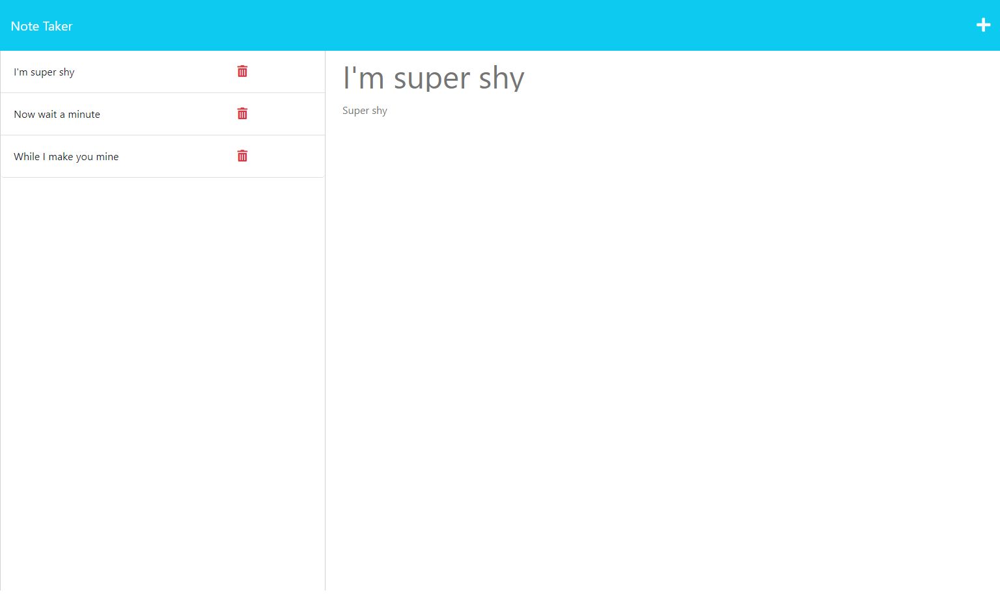

# Note-taker

## Description

I've made this Note Taker as a way to test out my knowledge and skills when it comes to using express.js and node.js, as well as working with api routes/methods. This challenge was not a particularly difficult one. I've come to find that reading express is actually pretty intuitive. When writing the routes, it was simply just a matter of knowing what data to pull(get), when and where to push the data, and what we needed to functionally import the information when using the app, such as express and uuid. The hardest part of this endeavor was actually the bonus question: How can we get the delete button to function correctly? After trial and error, I found that the path I was initially using to get the data from db.json was incorrect and after faltering many times, I found the fix! Every path needed just :id, no variations allowed. Everything works perfectly now, and I couldn't be happier! I hope if someone happens upon this app, they feel the same with the finished product.

## Usage

https://note-taker-me-now-6aa77b943f9e.herokuapp.com/notes

To use the note taker, simply run the program through heroku, and you will be directed to the homepage for Note taker. Click the Get Started button, it will lead you to the note taker app. On the center-right of the page, you can insert a text for the note title, as well as the note text. When you're done typing your note, you can save it by clicking the save icon located on the top right of the page. Or if you wish to add a new task instead, you click the add icon next to the save icon, and it will clear your text so you might write a new note. To delete old notes, click on the trash can of that particular note, and voila! It deletes. 

## License

MIT License

Copyright (c) [2023] [ValerieRojas]

Permission is hereby granted, free of charge, to any person obtaining a copy
of this software and associated documentation files (the "Software"), to deal
in the Software without restriction, including without limitation the rights
to use, copy, modify, merge, publish, distribute, sublicense, and/or sell
copies of the Software, and to permit persons to whom the Software is
furnished to do so, subject to the following conditions:

The above copyright notice and this permission notice shall be included in all
copies or substantial portions of the Software.

THE SOFTWARE IS PROVIDED "AS IS", WITHOUT WARRANTY OF ANY KIND, EXPRESS OR
IMPLIED, INCLUDING BUT NOT LIMITED TO THE WARRANTIES OF MERCHANTABILITY,
FITNESS FOR A PARTICULAR PURPOSE AND NONINFRINGEMENT. IN NO EVENT SHALL THE
AUTHORS OR COPYRIGHT HOLDERS BE LIABLE FOR ANY CLAIM, DAMAGES OR OTHER
LIABILITY, WHETHER IN AN ACTION OF CONTRACT, TORT OR OTHERWISE, ARISING FROM,
OUT OF OR IN CONNECTION WITH THE SOFTWARE OR THE USE OR OTHER DEALINGS IN THE
SOFTWARE.